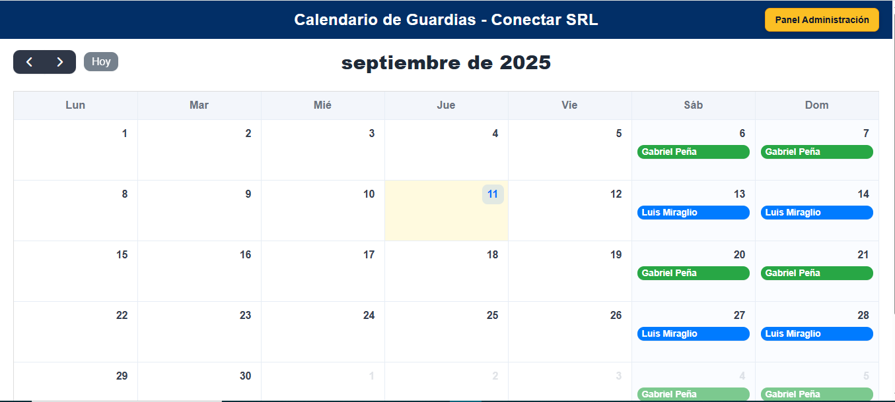
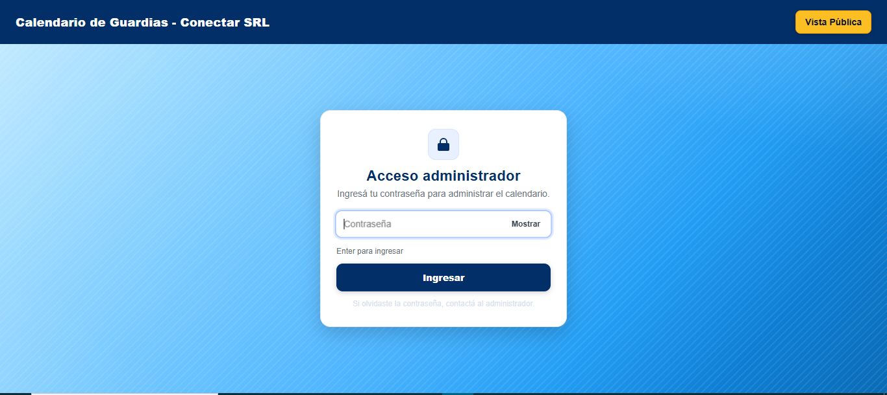
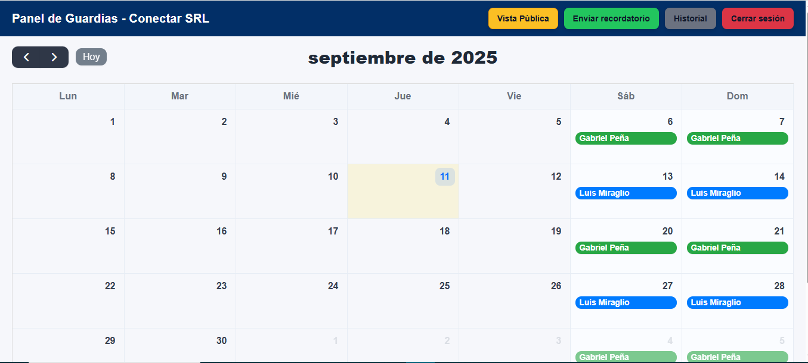
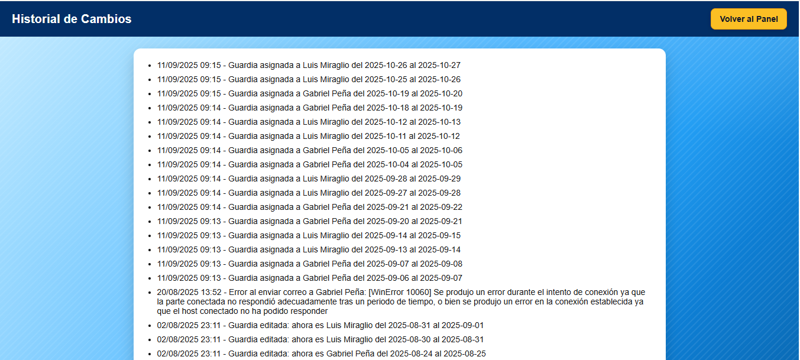
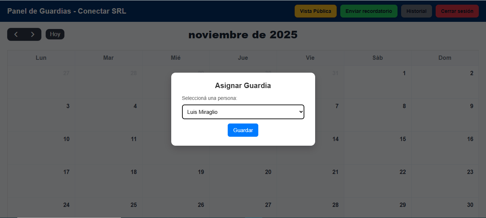

# Guardias-Laborales (Flask + SQLite + FullCalendar)

Calendario de guardias para **Conectar SRL** con vista pública y panel de administración.  
Permite asignar, editar y eliminar guardias por día, mantiene historial de cambios y envía recordatorios por correo.

---

## ✨ Características
- Vista **pública** del calendario (FullCalendar).
- **Panel admin** con login por contraseña.
- **CRUD** de guardias (AJAX).
- **Historial** de acciones.
- **Recordatorio por email** para el próximo sábado (endpoint manual).
- Deploy simple en **Render** (incluye `Procfile` y `render.yaml`).
- **DB versionada** en `instance/guardias.db` para que Render tome datos.

## 📸 Capturas de pantalla

### Vista pública


### Login administrador


### Panel de administración


### Historial


### Modal asignación



## 🧰 Stack
- Python 3.x, **Flask**, **Flask‑SQLAlchemy**, **Flask‑Mail**
- **SQLite**
- **FullCalendar 6** (CDN)

## 📁 Estructura del proyecto
```text
guardias-laborales/
├─ app.py
├─ requirements.txt
├─ Procfile
├─ render.yaml
├─ .gitignore
├─ .env                # local (NO subir)
├─ venv/               # local (NO subir)
└─ instance/
   ├─ guardias.db      # sí se versiona
   └─ templates/
      ├─ calendario.html
      ├─ admin.html
      ├─ historial.html
      └─ login.html
```
> 🔎 **Importante**: `app.py` renderiza `calendario.html` e `historial.html`.  
> Si tus archivos se llaman distinto (p. ej. `calebdrio.html` o `historila.html`), **renómbralos** para que coincidan.

## 🔐 Variables de entorno
Crear un archivo `.env` local con:
```ini
ADMIN_PASSWORD=tu_password_admin
MAIL_PASSWORD=tu_password_app_gmail   # contraseña de aplicación (no la de tu cuenta)
```
En **Render**, configurar estas mismas variables en *Environment → Environment Variables*.

## 📥 Clonar el repositorio

```bash
git clone https://github.com/LuisMiraglio/Guardias-Laborales.git
cd Guardias-Laborales


## 🏃‍♂️ Ejecución local

1) Crear entorno y dependencias
```bash
python -m venv venv
# Windows
venv\Scripts\activate
# Linux/Mac
source venv/bin/activate

pip install -r requirements.txt
```

2) Variables de entorno (opcional para modo dev)
```bash
# Windows PowerShell
$env:FLASK_ENV="development"
$env:ADMIN_PASSWORD="tu_password_admin"
$env:MAIL_PASSWORD="tu_password_app_gmail"
```

3) Inicializar DB (si fuera necesario)
```bash
python - << "PY"
from app import db, app
with app.app_context():
    db.create_all()
print("DB OK")
PY
```

4) Correr la app
```bash
python app.py
# http://localhost:5000
```

## 🔗 Endpoints principales
- `GET /` → Vista pública del calendario.
- `GET /admin` y `POST /admin` → Login de administrador.
- `GET /panel` → Panel de administración (requiere sesión).
- `GET /historial` → Historial de cambios (requiere sesión).
- `GET /enviar_recordatorio` → Envía email de recordatorio del próximo sábado (requiere sesión).

## 👥 Personas predefinidas
En `app.py` podés editar nombres, emails y colores:
```python
personas = {
  "Luis Miraglio":  {"email": "miraglioluis1@gmail.com", "color": "#007bff"},
  "Gabriel Peña":   {"email": "gabi.2018.p@gmail.com",   "color": "#28a745"},
  "Alejo Orellano": {"email": "alejo.orellano.ices@gmail.com", "color": "#dc3545"}
}
```

## 📬 Correo
- Servidor: Gmail SMTP (`smtp.gmail.com:587`, TLS).
- Usar **contraseña de aplicación** de Gmail (no la contraseña normal).
- El endpoint `/enviar_recordatorio` busca la guardia cuyo **inicio** sea el próximo **sábado** y envía un aviso a la persona asignada.

## ☁️ Despliegue en Render
Este repo incluye `Procfile` y `render.yaml`.

**Pasos:**
1. Conectar el repo a Render → **New Web Service**.
2. Elegir build de Python y activar **Auto-Deploy** (opcional).
3. En **Environment** agregar:
   - `ADMIN_PASSWORD`
   - `MAIL_PASSWORD`
4. Deploy. Render usará `instance/guardias.db` versionada para mostrar datos.

## 🧹 .gitignore recomendado
Se versiona `instance/guardias.db`. Se ignoran `venv/` y `.env`.
```gitignore
# Entorno
venv/
.venv/
__pycache__/
*.py[cod]
*.pyo
*.pyd

# Config local
.env
.env.*
!.env.example

# SQLite (permitimos solo nuestra DB)
*.db
!instance/guardias.db
```

## ✅ Checklist rápido
- [ ] `instance/guardias.db` existe y está **agregada** al repo.
- [ ] `calendario.html` y `historial.html` tienen esos **nombres exactos**.
- [ ] `.env` local con `ADMIN_PASSWORD` y `MAIL_PASSWORD`.
- [ ] En Render, variables de entorno configuradas.
- [ ] `git push` realizado para que Render despliegue.

## 📜 Licencia
MIT. Podés usar y adaptar libremente, manteniendo créditos.
